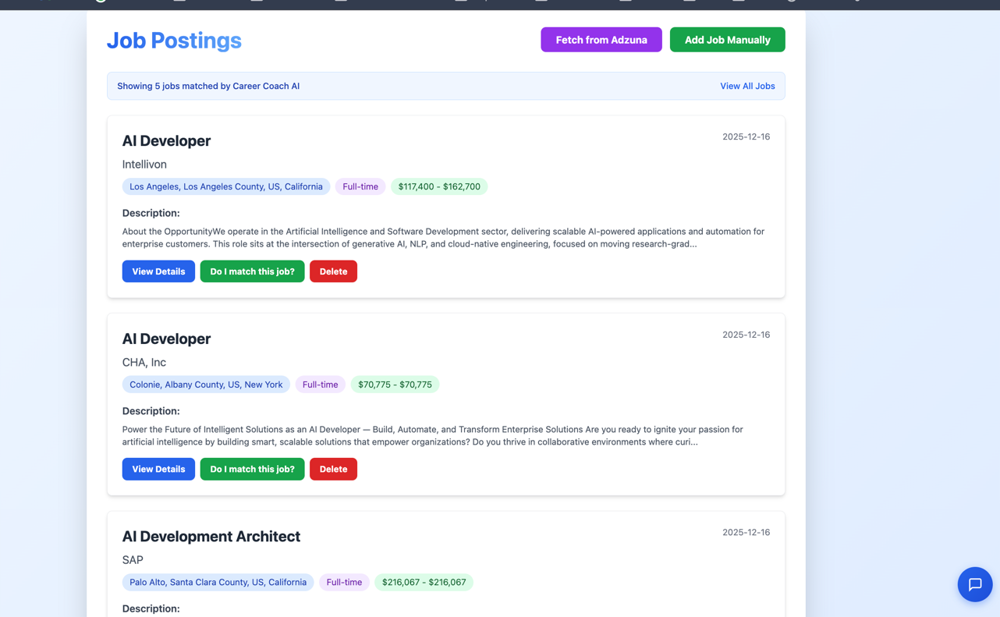
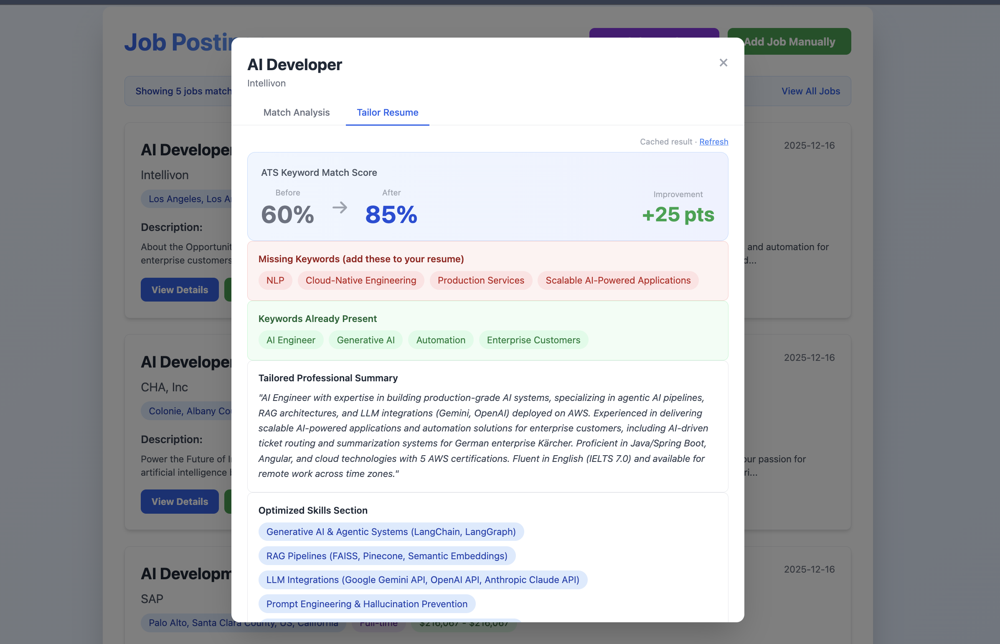
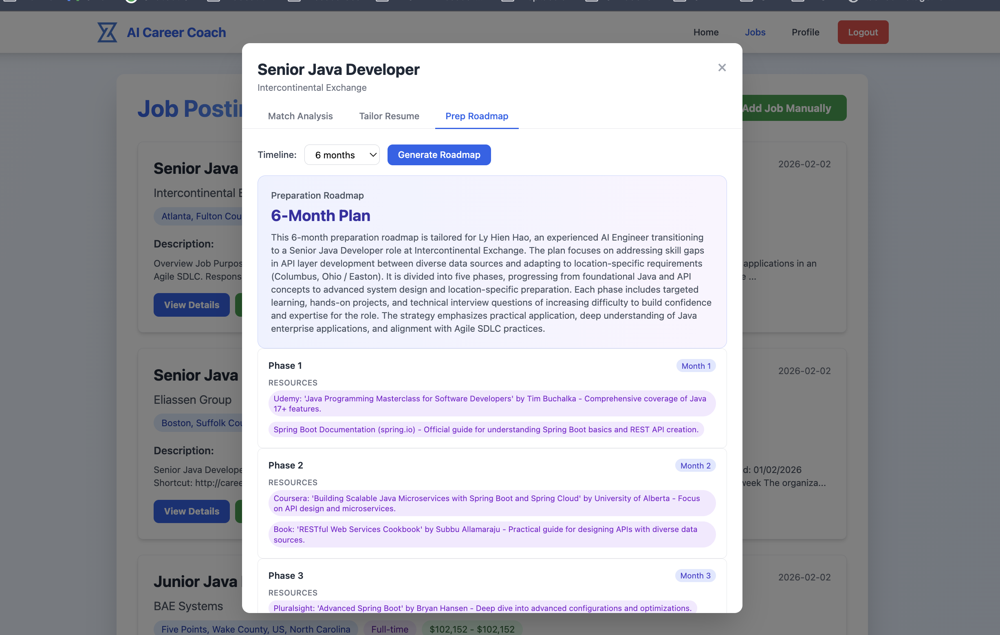
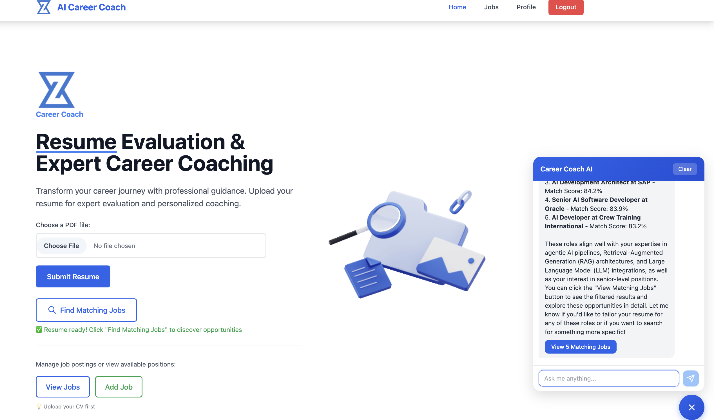
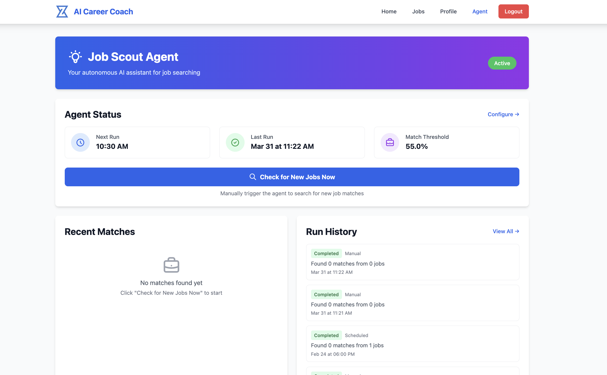

# AI Career Coach

> A production-grade agentic AI system that autonomously scouts jobs, matches candidates using semantic search, and coaches users through a multi-tool conversational agent — not a wrapper around an API call.

   

<p align="center">
  
</p>
<p align="center"><em>Semantic job matching — AI scores each role, identifies skill gaps, and gives personalized recommendations</em></p>

<p align="center">
  
</p>
<p align="center"><em>Resume tailoring — AI rewrites your CV to match specific job requirements, highlighting relevant experience</em></p>

<p align="center">
  
</p>
<p align="center"><em>Prep roadmap — generates a phased study plan with curated resources tailored to the specific role and your skill gaps</em></p>

<p align="center">
  
</p>
<p align="center"><em>Agentic chatbot — uses tools to search jobs, analyze resumes, and surface matches mid-conversation</em></p>

<p align="center">
  
</p>
<p align="center"><em>Job Scout Agent — runs autonomously on a schedule, configurable threshold, full run history</em></p>

## What This Demonstrates

This is a solo-built, end-to-end AI application — not a tutorial follow-along. It showcases:

| Skill | Implementation |
|-------|---------------|
| **Multi-agent orchestration** | Coordinator routes tasks to 4 specialist agents with model-specific cost/quality tradeoffs (Grok-3 vs Grok-3-mini) |
| **LangGraph state machines** | Job Scout runs as a graph with conditional edges, parallel execution, and checkpoint persistence |
| **RAG with evaluation** | FAISS vector store + contextual retrieval, measured by RAGAS eval suite |
| **Production engineering** | Rate limiting, semantic caching, DB indexing, prompt injection guards, streaming SSE |
| **Tool-use agents** | Chatbot with tool-calling (resume lookup, job search, skill gaps) + session-aware memory |
| **MCP integration** | Exposes capabilities as MCP tools with per-user auth scoping |

---

## Highlights

- **Multi-agent architecture** — Coordinator delegates tasks to specialized agents (security guard, keyword research, job analyst, resume tailoring) running on different models for cost/quality optimization
- **LangGraph state machine** — Job Scout Agent uses a graph-based workflow with conditional routing, parallel node execution, and checkpoint-based persistence
- **RAG pipeline** — Resume Q&A powered by FAISS vector store with HuggingFace embeddings and contextual retrieval
- **Semantic job matching** — Cosine similarity on embeddings + LLM-scored analysis produces ranked matches with skill gap identification
- **MCP server** — Exposes tools via Model Context Protocol with per-user API key scoping (zero cross-user access by design)
- **Prompt injection guard** — Regex + heuristic input validation layer protects both chat and PDF-extracted resume content
- **Streaming chat** — Server-sent events for real-time AI responses with session-aware conversation memory
- **Eval suite** — Automated evaluation harness using RAGAS for chat, job matching, memory, and resume tailoring quality
- **Production-ready** — Gunicorn + gevent workers, Flask-Limiter rate limiting, database indexing, semantic caching, Flask-Migrate for schema versioning

## Architecture

```
┌─────────────────────────────────────────────────────────────────┐
│  Client (Tailwind CSS + Framer Motion)                          │
└───────────────────────────────┬─────────────────────────────────┘
                                │
┌───────────────────────────────▼─────────────────────────────────┐
│  Flask Blueprints (Controllers)                                  │
│  auth · resume · jobs · agent · chat                             │
└───────────────┬──────────────────────────────┬──────────────────┘
                │                              │
┌───────────────▼───────────┐  ┌───────────────▼──────────────────┐
│  Services Layer            │  │  Agent System                     │
│  llm · resume · job        │  │  coordinator → specialist agents  │
│  input_guard · streaming   │  │  (LangGraph state machine)        │
│  semantic_cache             │  │                                   │
└───────────────┬───────────┘  └───────────────┬──────────────────┘
                │                              │
┌───────────────▼──────────────────────────────▼──────────────────┐
│  Data Layer                                                      │
│  SQLAlchemy ORM · FAISS vector indices · LangGraph checkpoints   │
└─────────────────────────────────────────────────────────────────┘
```

## Tech Stack

| Layer | Technology |
|-------|-----------|
| Backend | Flask, Gunicorn, gevent |
| AI/LLM | LangChain, LangGraph, xAI Grok-3 / Grok-3-mini |
| Embeddings | HuggingFace sentence-transformers, FAISS |
| Database | SQLAlchemy, Flask-Migrate (Alembic), SQLite / PostgreSQL |
| Security | Flask-Login, Flask-Limiter, input guard (prompt injection detection) |
| Observability | LangSmith tracing, structured logging |
| Evaluation | RAGAS, custom eval harness |
| External APIs | Adzuna (job listings), MCP (tool exposure) |
| Frontend | Jinja2, Tailwind CSS, Framer Motion, SSE streaming |

## Key Features

### Multi-Agent Job Scout
An autonomous agent that runs on a configurable schedule (APScheduler), searching for jobs matching your resume profile. Built as a LangGraph state machine with:
- Keyword research agent (Grok-3-mini) — extracts search terms from resume
- Job analyst agent (Grok-3) — scores and ranks results
- Resume tailoring agent (Grok-3) — suggests resume modifications per job
- Security guard agent (Grok-3-mini) — validates all inputs before processing

### Semantic Resume Matching
1. PDF text extraction (PyPDF2 + pdfplumber)
2. Chunk and embed with HuggingFace sentence-transformers
3. Store in FAISS index for O(log n) similarity search
4. LLM-scored match analysis with skill gap identification
5. Personalized recommendations for each job match

### Conversational Career Coach
- Tool-calling agent with access to resume data, job matches, and skill gaps
- Session-aware memory with automatic summarization at session boundaries
- Intent detection for routing (job search, resume feedback, general advice)
- Streaming responses via Server-Sent Events

### MCP Server Integration
Exposes career coaching capabilities as MCP tools for use in Claude Code or other MCP clients:
- `analyze_resume` — full resume analysis
- `find_matching_jobs` — semantic job search
- `get_skill_gaps` — targeted gap analysis
- `trigger_job_scout` — on-demand agent run

### Security & Reliability
- Input validation guard against prompt injection (chat + PDF vectors)
- Per-user API key scoping on MCP server (cross-user access architecturally impossible)
- Rate limiting on all endpoints
- Database indexes for query performance
- Semantic caching to reduce redundant LLM calls

## Getting Started

### Prerequisites
- Python 3.10+
- xAI API key ([platform.x.ai](https://platform.x.ai))
- Adzuna API credentials ([developer.adzuna.com](https://developer.adzuna.com)) — optional, for live job fetching

### Installation

```bash
git clone https://github.com/Hao1998/AiCareerCoach.git
cd AiCareerCoach

python -m venv venv
source venv/bin/activate

pip install -r requirements.txt

cp .env.example .env
# Edit .env with your API keys
```

### Run

```bash
# Development
python app.py  # → http://localhost:5001

# Production
gunicorn wsgi:app -c gunicorn.conf.py

# MCP Server
python mcp_server.py  # → http://localhost:8001
```

### Database Migrations

```bash
flask --app wsgi db migrate -m "describe change"
flask --app wsgi db upgrade
```

## Project Structure

```
├── factory.py              # App factory (create_app)
├── config.py               # Environment configs
├── models.py               # SQLAlchemy models
├── controllers/            # Flask blueprints (route handlers)
│   ├── auth_controller.py
│   ├── resume_controller.py
│   ├── job_controller.py
│   ├── agent_controller.py
│   └── chat_controller.py
├── services/               # Business logic layer
│   ├── llm_service.py
│   ├── resume_service.py
│   ├── job_service.py
│   ├── input_guard.py
│   ├── streaming.py
│   └── semantic_cache.py
├── agents/                 # Multi-agent system
│   ├── coordinator.py      # Model routing & agent lifecycle
│   ├── security_guard_agent.py
│   ├── keyword_research_agent.py
│   ├── job_analyst_agent.py
│   └── resume_tailoring_agent.py
├── chatbot/                # Conversational agent
│   ├── agent.py            # AgentExecutor + intent detection
│   ├── memory.py           # Session-aware conversation memory
│   └── tools.py            # Tool definitions
├── mcp_server.py           # MCP tool server
├── evals/                  # Evaluation suite (RAGAS)
├── migrations/             # Alembic version scripts
└── templates/              # Jinja2 frontend
```

## Evaluation

The project includes an automated eval suite for measuring AI quality:

```bash
python evals/run_all.py
```

Evaluates: chat response quality, job match accuracy, memory retrieval, and resume tailoring fidelity using RAGAS metrics.

## License

MIT
